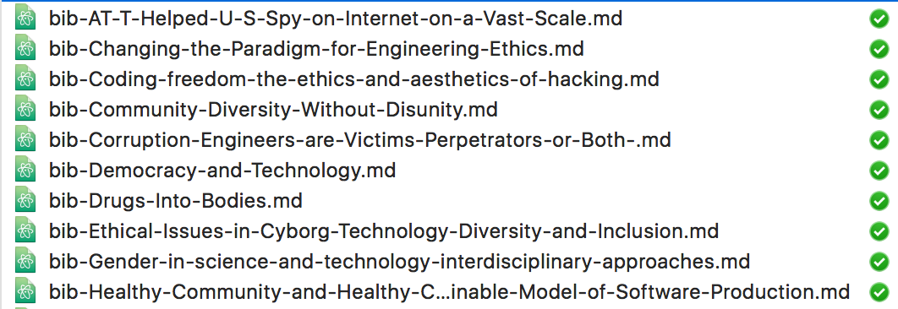

# What's this?!

This is a script I wrote a script that:
1. finds all of the notes attached to items in Zotero
2. finds out the title of the item that note belongs to
3. stores that note as it's own [Markdown](https://en.wikipedia.org/wiki/Markdown) file, named after the item title.

When I run it, I get output that looks like:

# Why would I use this?
I think you'd use it if you wanted to get your stuff out of Zotero in order to do something with it, or if you were migrating to another sytem.  But here's why I use this script (warning, it's long): I use Zotero like a big database to store not just my citations, but all of my notes about All Of The Things related to those citations.  So, everything that I read goes into Zotero, along with all of my notes about those things.  With everything in one place, I can use Zotero to generate an annotated bibliography to give to a professor, or to see every note that I've taken that has a certain phrase in it.  As a result, there's a _ton_ of information in Zotero.   But I keep all of my notes for school and projects in markdown files.  So, because I don't want to have to search in two places, this script lets me export my Zotero notes to text for searching.

# How do I use it?

I wish that this script were friendlier to folks who don't feel comfortable installing `pip` libraries on their system and who don't want to edit python code.  I welcome contributions from people who can make this more accessible for Zotero users who don't want to open a terminal.

But, if you're okay with doing some (safe!) terminal stuff and you're on OSX:
1. Download the [`notes-to-md.py`](https://github.com/drnikki/zotero-util/blob/master/notes-to-md.py) file (either by cloning the git repository or by copying the text of it and saving it to a file locally.  Make sure the file has a `.py` extension.).

1. In the file, replace the lines at the top with your information.  You'll need to login to the zotero site to find your API key and user number.  Here is some information about how to do this [here](http://pyzotero.readthedocs.io/en/latest/index.html?highlight=search%20parameters#getting-started-short-version).

1. Install the necessary libraries by opening a terminal and running `pip install pyzotero`

1. Still in the terminal, find the file and run `./notes-to-py.md`

If you get unexpected results, change the filter - you can grab all notes, all notes by tag,or a combination of the above.  If you need help getting it to run a certain way, just let me know either here or on github or twitter.
